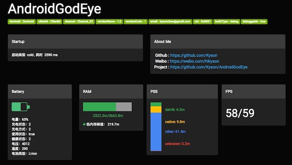
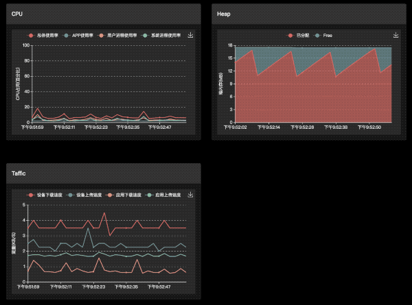

<p align="center">
  
</p>

<h1 align="center">AndroidGodEye</h1>
<p align="center">
<a href="https://travis-ci.org/Kyson/AndroidGodEye" target="_blank"></img></a>
<a href="http://androidweekly.net/issues/issue-293" target="_blank"></img></a>
<a href="https://android-arsenal.com/details/1/6561" target="_blank"></img></a>
<a href="LICENSE" target="_blank"></img></a>
</p>
<br/>

<p>
<a href="README.md">English README.md</a>&nbsp;&nbsp;&nbsp;
<a href="README_zh.md">中文 README_zh.md</a>
</p>

> Android developer lack of monitoring of performance data,especially in production environment. so we need "AndroidGodEye".

## Overview


AndroidGodEye is a performance monitor tool for Android(not limited to performance data) , you can easily monitor the performance of your app in real time in pc browser.

It is divided into 3 parts:

1. Core provide all performance modules and produce performance datas.
2. Debug Monitor provide a dashboard to show these performance datas.
3. Toolbox make developers easy to use this library.

AndroidGodEye prodive several modules, such as cpu, heap, block, leak memory and so on.

## Quickstart

Demo:[https://github.com/Kyson/AndroidGodEyeDemo](https://github.com/Kyson/AndroidGodEyeDemo)

### Step1 Dependencies

In your build.gradle:

```
dependencies {
  implementation 'cn.hikyson.godeye:godeye-core:VERSION_NAME'
  debugImplementation 'cn.hikyson.godeye:godeye-monitor:VERSION_NAME'
  releaseImplementation 'cn.hikyson.godeye:godeye-monitor-no-op:VERSION_NAME'
  implementation 'cn.hikyson.godeye:godeye-toolbox:VERSION_NAME'
}
```

> You can find VERSION_NAME in the github release.

### Step2 Initialize And Install Modules

Init first in your application:

```java
GodEye.instance().init(this);
```

Install modules , GodEye class is entrance for this step, all modules are provided by it.

```java
if (isMainProcess(this)) {//can not install modules in sub process
        // You can find assets file sample in assets path of android-godeye module
        GodEye.instance().install(GodEyeConfig.fromAssets("android-godeye-config/install.config"));
}

/**
* is main process
*/
    private static boolean isMainProcess(Application application) {
        int pid = android.os.Process.myPid();
        String processName = "";
        ActivityManager manager = (ActivityManager) application.getSystemService
                (Context.ACTIVITY_SERVICE);
        for (ActivityManager.RunningAppProcessInfo process : manager.getRunningAppProcesses()) {
            if (process.pid == pid) {
                processName = process.processName;
            }
        }
        return application.getPackageName().equals(processName);
    }
```

> Recommend install in application.

#### Optional Uninstall Modules

Uninstall modules when you don't need it(not recommend):

```java
GodEye.instance().uninstall();
```

> Note that network and startup module don't need install and uninstall.

When install finished, GodEye begin produce performance data, generally you can call consume of modules to get these datas, for example：

```java
GodEye.instance().<Cpu>getModule(GodEye.ModuleName.CPU).subject().subscribe()
```

> Just like we will mention later,Debug Monitor is one of these consumers.

### Step3 Install Performance Visualization Dashboard
                  
GodEyeMonitor class is entrance for this step.

Start performance visualization dashboard:

```java
GodEyeMonitor.work(context)
```

Stop it:

```java
GodEyeMonitor.shutDown()
```

### Install IDE Plugin

Install Android Studio plug-in(`android-godeye-idea-plugin/android-godeye-idea-plugin.jar`),Then you can find AndroidGodEye in main toolbar,click it and it will open dashboard in browser.

Connect mobile phones and computers with USB, run `adb forward tcp:5390 tcp:5390`, then open `http://localhost:port/index.html`(**Note that /index.html is necessary!!!**) on PC. If you don't have a USB, you can also open `http://mobile ip:port/index.html` directly, ensure that mobile phones and PC are in the same LAN segment of course.

> Default port is 5390, you can find ip in logcat output after call `GodEyeMonitor.work(context,port)`, log is like:'Open AndroidGodEye dashboard [ http://ip:port/index.html" ] in your browser...'.

Now enjoy it!

**If you just want to see the results, you can install [APK](https://fir.im/5k67) directly.**

## Performance Visualization Dashboard

###### Click  ↓  to preview

<p>
<a href="https://player.youku.com/embed/XMzIwMTgyOTI5Mg==" target:"_blank">

</a>
</p>

### Base info



### Block Detector


### Leak Memory Detector


### More



and more...

## Modules

|Module Name|Need Install|Engine|Data produce time|permissions|
|-----------|------------|------|-----------------|-----------|
|cpu|yes|internal|interval|no|
|battery|yes|internal|interval|no|
|fps|yes|internal|interval|no|
|leakDetector|yes|internal|happen|no|
|heap|yes|internal|interval|no|
|pss|yes|internal|interval|no|
|ram|yes|internal|interval|no|
|network|no|external|-|no|
|sm|yes|internal|happen|no|
|startup|no|external|-|no|
|traffic|yes|external|interval|no|
|crash|yes|external|after install,one time|no|
|thread dump|yes|internal|interval|no|
|pageload|yes|internal|happen|no|

## Framework

How does AndroidGodEye work？As below:


## License

AndroidGodEye is under Apache2.0.

## About Me

- Github: [Kyson](https://github.com/Kyson)
- Weibo: [hikyson](https://weibo.com/hikyson)
- Blog: [tech.hikyson.cn](https://tech.hikyson.cn/)


