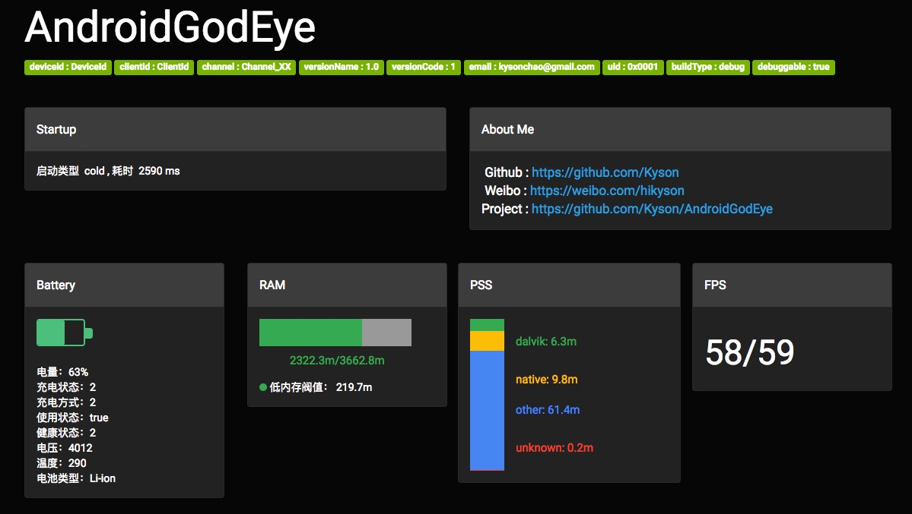

<p align="center">
  
</p>

<h1 align="center">AndroidGodEye</h1>
<p align="center">
<a href="https://travis-ci.org/Kyson/AndroidGodEye" target="_blank"></img></a>
<a href="https://jitpack.io/#Kyson/AndroidGodEye" target="_blank"></img></a>

</p>
<br/>

<p>
<a href="README.md">README_en</a>&nbsp;&nbsp;&nbsp;
<a href="README_zh.md">README_zh</a>
</p>

> Android developer lack of monitoring of performance data,especially in production environment. so we need "AndroidGodEye".

## Overview

AndroidGodEye is a performance monitor tool for Android , but not limited to performance data.

It is divided into 3 parts:

1. Core provide all performance modules and produce performance datas.
2. Debug Monitor provide a panel to show these performance datas.
3. Toolbox make developers easy to use this library.

Currently, AndroidGodEye prodive 11 modules, such as cpu, heap, block, leak memory and so on.

## Quickstart

### Step1

In your build.gradle:

```
dependencies {
  implementation 'cn.hikyson.godeye:godeye-core:VERSION_NAME'
  debugImplementation 'cn.hikyson.godeye:godeye-monitor:VERSION_NAME'
  releaseImplementation 'cn.hikyson.godeye:godeye-monitor-no-op:VERSION_NAME'
  implementation 'cn.hikyson.godeye:godeye-toolbox:VERSION_NAME'
}
```

> You can find VERSION_NAME in the github release.

### Step2

Install modules , GodEye class is entrance for this step, all modules are provided by it.

```java
GodEye.instance().installAll(getApplication())
```

> Recommended to be installed in application.

#### Optional

Uninstall modules when you don't need it:

```java
GodEye.instance().uninstallAll()
```

if you don't need all modules , you can install separately, such as "cpu":

```java
GodEye.instance().cpu().install()
```

> Note that network and startup module don't need install and uninstall.

When install finished, GodEye begin produce performance data, generally you can call consume of modules to get these datas, for example：

```java
GodEye.instance().cpu().consume().subscribe()
```

> Just like we will mention later,Debug Monitor is one of these consumers.

### Step3

Install debug monitor,GodEyeMonitor class is entrance for this step.

Consume data produced by GodEye modules:

```java
GodEyeMonitor.work(context)
```

Stop it:

```java
GodEyeMonitor.shutDown()
```

### Step4

You're good to go!

Make sure your android device and pc are on the same network segment, and open browser on pc,
open `Android device ip : Port`, now enjoy it!

> Default port is 5390, you can find ip in logcat output after call `GodEyeMonitor.work(context)`, log is like:'Open AndroidGodEye dashboard [ http://xxx.xxx.xxx.xxx:5390" ] in your browser...'.

## Debug Monitor

###### Click  ↓  to preview

<p>
<a href="https://player.youku.com/embed/XMzIwMTgyOTI5Mg==" target:"_blank">

</a>
</p>

### Part1

Basic info 



### Part2

Leak Memory Detector


### Part more

And more...

## License

AndroidGodEye is under Apache2.0.

## About Me

- Github: [Kyson](https://github.com/Kyson)
- Weibo: [hikyson](https://weibo.com/hikyson)
- Blog: [tech.hikyson.cn](https://tech.hikyson.cn/)


