<p align="center">
  
</p>

<h1 align="center">AndroidGodEye</h1>
<p align="center">
<a href="https://travis-ci.org/Kyson/AndroidGodEye" target="_blank"></img></a>
<a href="https://app.codacy.com/app/Kyson/AndroidGodEye?utm_source=github.com&utm_medium=referral&utm_content=Kyson/AndroidGodEye&utm_campaign=Badge_Grade_Settings" target="_blank"></img></a>
<a href="https://github.com/Kyson/AndroidGodEye/tags" target="_blank"></img></a>
<a href="http://androidweekly.net/issues/issue-293" target="_blank"></img></a>
<a href="https://android-arsenal.com/details/1/6561" target="_blank"></img></a>
<a href="LICENSE" target="_blank"></img></a>
</p>
<br/>

<p>
<a href="README.md">English README.md</a>&nbsp;&nbsp;&nbsp;
<a href="README_zh.md">中文 README_zh.md</a>
</p>

> Android开发者在性能检测方面的工具一直比较匮乏，仅有的一些工具，比如Android Device Monitor，使用起来也有些繁琐，对开发者能力有一定的要求。而线上的App监控更无从谈起。所以需要有一个系统能够提供Debug和Release阶段全方位的监控，更深入地了解对App运行时的状态。

## 概览

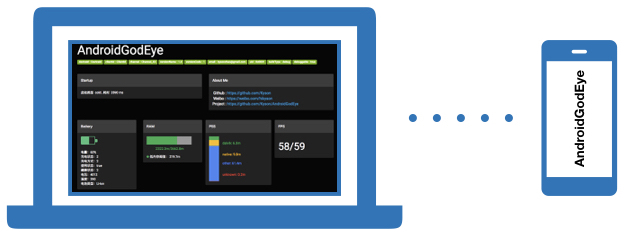

AndroidGodEye是一个可以在PC浏览器中实时监控Android性能数据指标的工具，你可以通过wifi/usb连接手机和pc，通过pc浏览器实时监控手机性能。

系统分为三部分：

1. Core 核心部分，提供所有模块
2. Debug Monitor部分，提供Debug阶段开发者面板
3. Toolbox 快速接入工具集，给开发者提供各种便捷接入的工具

AndroidGodEye提供了多种监控模块，比如cpu、内存、卡顿、内存泄漏等等，并且提供了Debug阶段的Monitor看板实时展示这些数据。而且提供了api供开发者在release阶段进行数据上报。

## 快速开始

[Demo APK](https://fir.im/5k67)，可以先看看效果 :-)

[Demo Project:https://github.com/Kyson/AndroidGodEyeDemo](https://github.com/Kyson/AndroidGodEyeDemo)

### STEP1 依赖引入

#### 1. 添加AndroidGodEye依赖

在需要的Module的`build.gradle`中添加

```groovy
dependencies {
  implementation 'cn.hikyson.godeye:godeye-core:VERSION_NAME'
  debugImplementation 'cn.hikyson.godeye:godeye-monitor:VERSION_NAME'
  releaseImplementation 'cn.hikyson.godeye:godeye-monitor-no-op:VERSION_NAME'
  implementation 'cn.hikyson.godeye:godeye-toolbox:VERSION_NAME'
}
```

> VERSION_NAME参考 [Github release](https://github.com/Kyson/AndroidGodEye/releases)

#### 2. 添加MethodCanary依赖

在Root Project的`build.gradle`中添加

```groovy
buildscript {
    repositories {
        jcenter()
    }
    dependencies {
        classpath "cn.hikyson.methodcanary:plugin:PLUGIN_VERSION_NAME"
    }
}
```

> PLUGIN_VERSION_NAME参考 [MethodCanary github release](https://github.com/Kyson/MethodCanary/releases)

在Application Module Project（`'com.android.application'`）的`build.gradle`中添加

```groovy
apply plugin: 'cn.hikyson.methodcanary.plugin'
```

在项目根目录下新建js文件：`MethodCanary.js`用于配置MethodCanary的插桩逻辑，内容如下：

```
/**
    classInfo
        {int access
         String name
         String superName
         String[] interfaces}

     methodInfo
         {int access
         String name
         String desc}
**/
function isExclude(classInfo,methodInfo){
    return false
}

function isInclude(classInfo,methodInfo){
    return classInfo.name.startsWith('cn/hikyson/godeyedemo'))
}
```

[如何配置MethodCanary.js](https://github.com/Kyson/AndroidGodEye/wiki/0x01-Module-MethodCanary)

### STEP2 初始化并安装所需模块

Application中初始化:

```java
GodEye.instance().init(this);
```

模块安装，GodEye类是AndroidGodEye的核心类，所有模块由它提供。

在需要的时候安装所有模块（建议在`application onCreate`中）：

```java
if (ProcessUtils.isMainProcess(this)) {//install in main process
    GodEye.instance().install(GodEyeConfig.fromAssets("<config path>"));
}
```

"\<config path\>"为配置文件在assets下的目录路径，内容参考：[install.config](https://github.com/Kyson/AndroidGodEye/blob/master/android-godeye-sample/src/main/assets/android-godeye-config/install.config)

[卸载模块](https://github.com/Kyson/AndroidGodEye/wiki/0x00-Work-Flow-Overview)

### STEP3 安装性能可视化面板

GodEyeMonitor类是AndroidGodEye的性能可视化面板的主要类，用来开始或者停止性能可视化面板的监控。

开启性能可视化面板：

```java
GodEyeMonitor.work(context)
```

关闭面板：

```java
GodEyeMonitor.shutDown()
```

usb连上你的手机，接下来可以开始运行你的项目了！

[生产环境使用AndroidGodEye](https://github.com/Kyson/AndroidGodEye/wiki/0x00-Work-Flow-Overview)

### STEP4 安装IDE插件

在AndroidStudio中安装AndroidGodEye插件，在AndroidStudio plugin中直接搜索AndroidGodEye即可，安装完之后会在工具栏中出现AndroidGodEye的icon，点击即可在浏览器中打开性能监控面板。


[没有USB线?]()

[没有安装Android Studio?]()

#### 可选部分

手机和电脑用USB连接，并执行`adb forward tcp:5390 tcp:5390`，然后在pc浏览器中访问`http://localhost:5390/index.html`(**注意：/index.html 是必须加上的**)就可以看到开发者面板了。如果没有USB线，也可以直接访问`http://手机ip+端口+/index.html`，当然，必须确保手机和pc在同一局域网网段。

> 端口默认是5390，也可以在`GodEyeMonitor.work(context,port)`中指定，一般在开发者在调用`GodEyeMonitor.work(context,port)`之后可以看到日志输出 'Open AndroidGodEye dashboard [ http://ip:port/index.html" ] in your browser...' 中包含了访问地址。

Done!

## 性能可视化面板

###### 点击下面预览↓

<p>
<a href="https://player.youku.com/embed/XMzIwMTgyOTI5Mg==" target:"_blank">

</a>
</p>

### MethodCanary

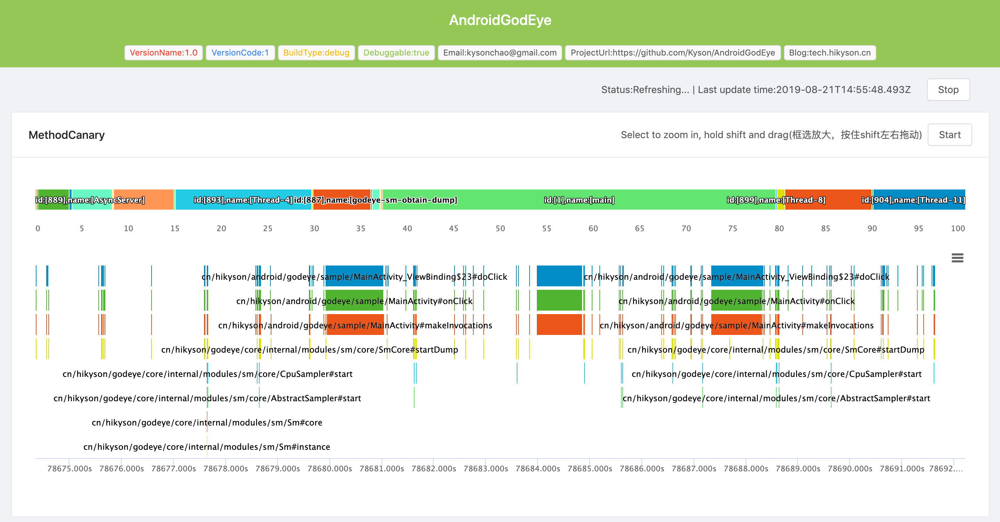

### Fps/RAM/PSS/Battery...

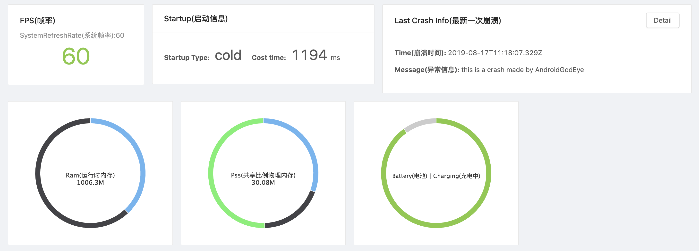

### Cpu/Heap/Traffic...

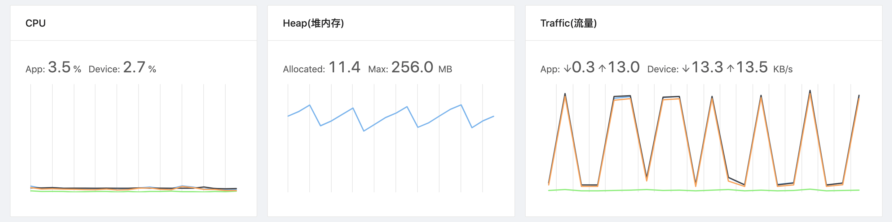

### Leak Memory/App Jank(Block)

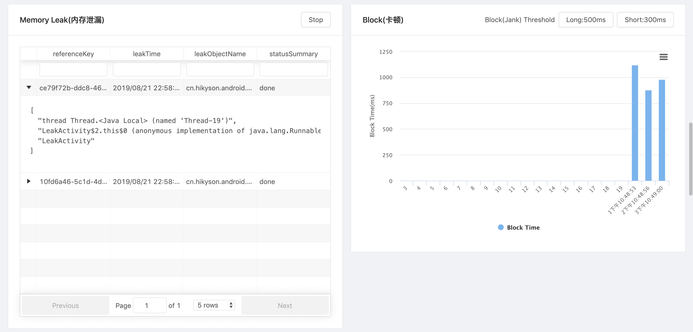

**Leak Memory GIF**

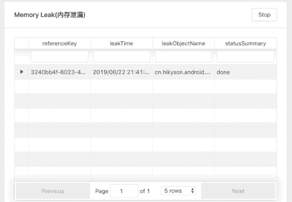

**Jank(Block) GIF**

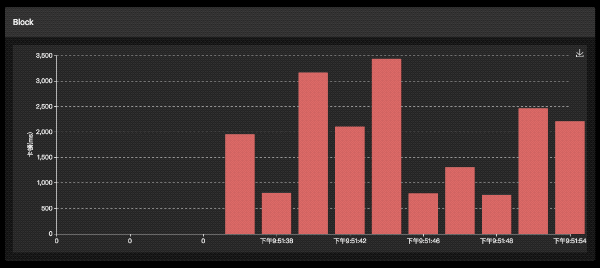

### Page Lifecycle(Page Load)/Network

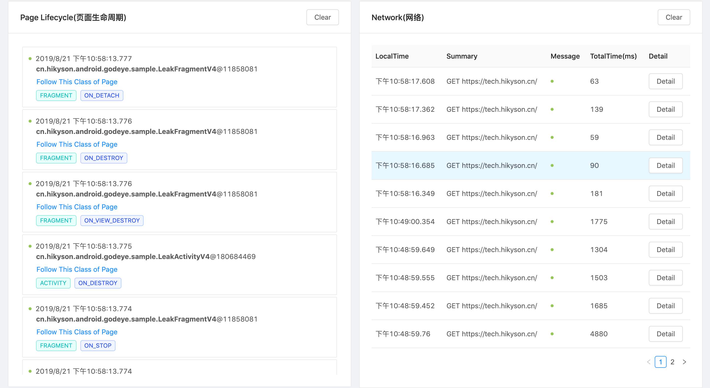

**Page Lifecycle(Page Load) GIF**

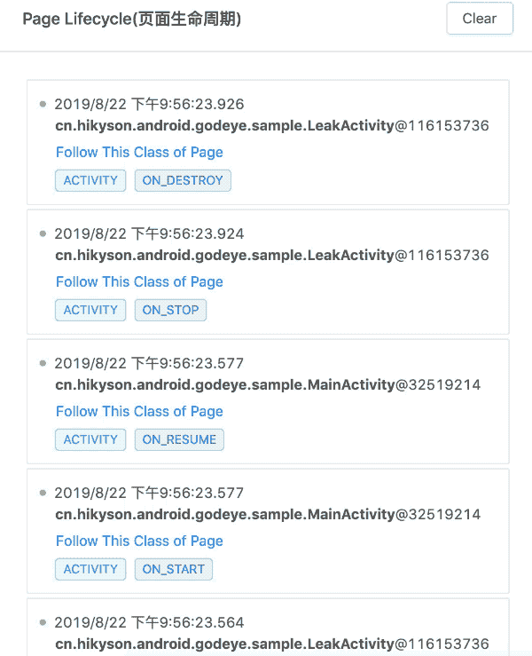

**Network GIF**

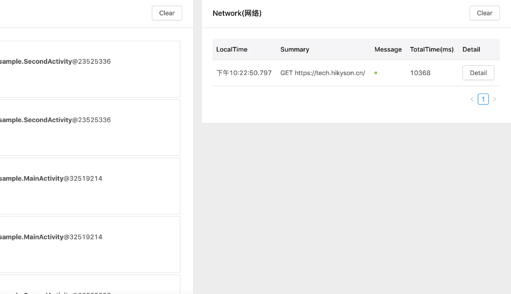

**Network Detail**

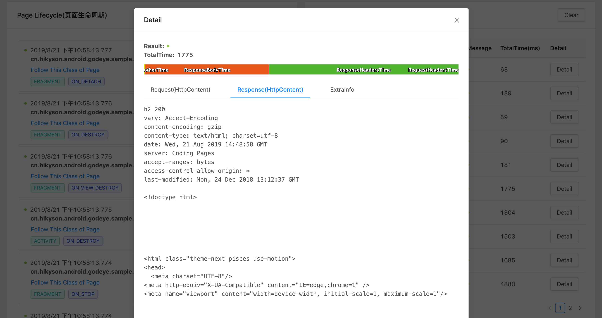

### Thread

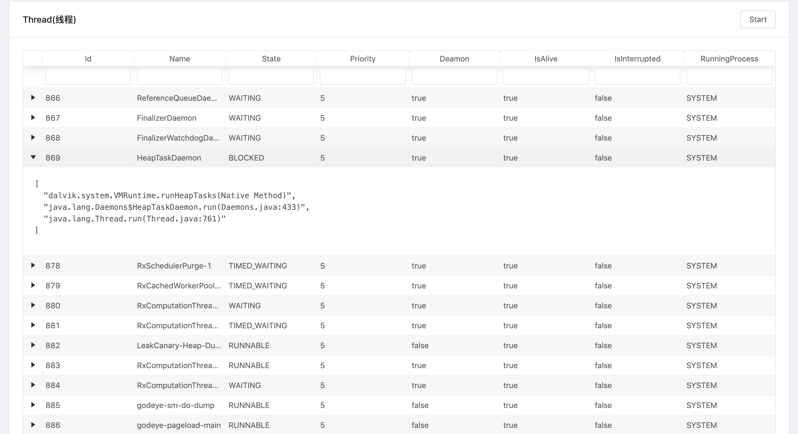

## 模块详情

|模块名|数据生产时机|配置|备注|
|-----|-------|---------|---|----|
|network|外部输入时输出|无|-|
|startup|外部输入时输出|无|-|
|battery|电池变化时输出|无|-|
|cpu|定时输出|intervalMillis-每隔x毫秒输出数据，sampleMillis-采样间隔|系统版本大于8.0失效|
|crash|安装后，输出上次崩溃|crashProvider-实现CrashProvider的类path，一般用内置cn.hikyson.godeye.core.internal.modules.crash.CrashFileProvider即可|-|
|fps|定时输出|intervalMillis-输出间隔|-|
|heap|定时输出|intervalMillis-输出间隔|-|
|leakDetector(leakMemory)|页面销毁且泄漏时|debug-是否需要解析gc引用链，debugNotification泄漏时是否需要通知，leakRefInfoProvider-实现LeakRefInfoProvider的类path，一般用内置cn.hikyson.godeye.core.internal.modules.leakdetector.DefaultLeakRefInfoProvider|-|
|pageload|页面create/draw/destory/load/hide/show等输出|pageInfoProvider-根据页面实例提供页面信息|fragment的显示隐藏需要手动调用show hide api,页面加载手动调用load api|
|pss|定时输出|intervalMillis-输出间隔|-|
|ram|定时输出|intervalMillis-输出间隔|-|
|sm|卡顿时输出|debugNotify-卡顿是否需要通知，dumpIntervalMillis-dump堆栈间隔，longBlockThresholdMillis-长卡顿阈值，shortBlockThresholdMillis-短卡顿阈值|-|
|thread|定时|intervalMillis-输出间隔，threadFilter-过滤器，实现ThreadFilter类path，一般用内置cn.hikyson.godeye.core.internal.modules.thread.SimpleThreadFilter即可|-|
|traffic|定时输出|intervalMillis-输出间隔，sampleMillis-采样间隔|-|
|methodCanary|停止后输出|maxMethodCountSingleThreadByCost-每个线程最多记录的方法数，lowCostMethodThresholdMillis-方法耗时阈值|-|

## 框架

下图可以更清楚地解释AndroidGodEye是如何工作的：

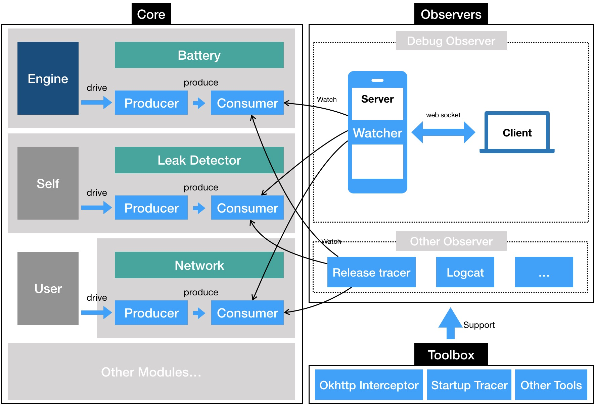

## 许可协议

AndroidGodEye使用 Apache2.0 许可协议。

## 贡献者

- [ahhbzyz](https://github.com/ahhbzyz)
- [Xiangxingqian](https://github.com/Xiangxingqian)

## 关于我

- Github: [Kyson](https://github.com/Kyson)
- Weibo: [hikyson](https://weibo.com/hikyson)
- Blog: [tech.hikyson.cn](https://tech.hikyson.cn/)


