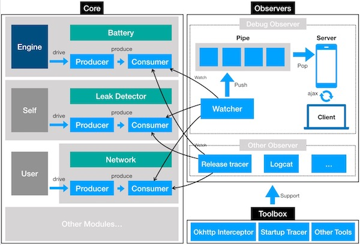

<p align="center">
  
</p>

<h1 align="center">AndroidGodEye</h1>
<p align="center">
<a href="https://travis-ci.org/Kyson/AndroidGodEye" target="_blank"></img></a>
<a href="https://oss.sonatype.org/content/repositories/releases/cn/hikyson/godeye/godeye-core/" target="_blank"></img></a>
<a href="https://jitpack.io/#Kyson/AndroidGodEye" target="_blank"></img></a>
<a href="LICENSE" target="_blank"></img></a>
</p>
<br/>

<p>
<a href="README.md">README_en</a>&nbsp;&nbsp;&nbsp;
<a href="README_zh.md">README_zh</a>
</p>

> Android开发者在性能检测方面的工具一直比较匮乏，仅有的一些工具，比如Android Device Monitor，使用起来也有些繁琐，使用起来对开发者有一定的要求。而线上的App监控更无从谈起。所以需要有一个系统能够提供Debug和Release阶段全方位的监控，更深入地了解对App运行时的状态。

## 概览


AndroidGodEye是一个可以在PC浏览器中实时监控Android数据指标（比如性能指标，但是不局限于性能）的工具，你可以通过wifi连接手机和pc，通过pc浏览器实时监控手机性能。

系统分为三部分：

1. Core 核心部分，提供所有模块
2. Debug Monitor部分，提供Debug阶段开发者面板
3. Toolbox 快速接入工具集，给开发者提供各种便捷接入的工具

目前，AndroidGodEye提供了11种监控模块，比如cpu、内存、卡顿、内存泄漏等等，并且提供了Debug阶段的Monitor看板实时展示这
些数据。而且提供了api供开发者在release阶段进行数据上报。

## 快速开始

### STEP1

引入依赖，使用gradle

```
dependencies {
  implementation 'cn.hikyson.godeye:godeye-core:VERSION_NAME'
  debugImplementation 'cn.hikyson.godeye:godeye-monitor:VERSION_NAME'
  releaseImplementation 'cn.hikyson.godeye:godeye-monitor-no-op:VERSION_NAME'
  implementation 'cn.hikyson.godeye:godeye-toolbox:VERSION_NAME'
}
```

> VERSION_NAME可以看github的release名称

### STEP2

模块安装，GodEye类是AndroidGodEye的核心类，所有模块由它提供。

在应用入口安装所有模块：

```java
GodEye.instance().installAll(getApplication());
```

> 推荐在application中进行安装

#### 可选部分

不需要的时候卸载所有模块：

```java
GodEye.instance().uninstallAll();
```

如果不想要所有的模块，你也可以自己安装想要的模块，比如`GodEye.instance().cpu().install()`

> 注意：network和startup模块不需要安装和卸载

安装完之后相应的模块就开始输出数据了，一般来说可以使用模块的consume方法进行消费，比如cpu模块：

```java
GodEye.instance().cpu().subject().subscribe()
```

> 就像我们之后会提到的Debug Monitor，也是通过消费这些数据进行展示的

### STEP3

Debug面板安装，GodEyeMonitor类是AndroidGodEye的Debug监控面板的主要类，用来开始或者停止Debug面板的监控。

开始消费GodEye各个模块数据并输出到Debug面板：

```java
GodEyeMonitor.work(context)
```

结束消费，关闭Debug面板：

```java
GodEyeMonitor.shutDown()
```

### STEP4

完成！开始使用：

手机与pc连接同一网段，在pc浏览器中访问 手机ip+端口 即可看到Debug面板!

> 端口默认是5390，也可以在`GodEyeMonitor.work(context)`中指定，一般在开发者在调用`GodEyeMonitor.work(context)`之后可以看到日志输出 'Open AndroidGodEye dashboard [ http://xxx.xxx.xxx.xxx:5390" ] in your browser...' 中包含了访问地址。


**好吧，如果你懒得自己编译这个项目的话，你也可以先下载 [APK](https://fir.im/5k67) 看看效果。**

## Debug开发者面板

###### 点击下面预览↓

<p>
<a href="https://player.youku.com/embed/XMzIwMTgyOTI5Mg==" target:"_blank">

</a>
</p>

### Base info


### 卡顿检测


### 内存泄漏检测


### 更多模块


还有更多...

## 框架

下图可以更清楚地解释AndroidGodEye是如何工作的：



## 许可协议

AndroidGodEye使用 Apache2.0 许可协议。

## 关于我

- Github: [Kyson](https://github.com/Kyson)
- Weibo: [hikyson](https://weibo.com/hikyson)
- Blog: [tech.hikyson.cn](https://tech.hikyson.cn/)


